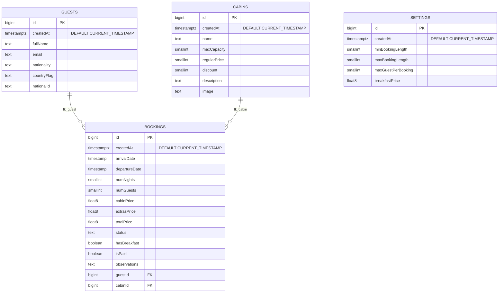

```mermaid
    erDiagram
    CABINS {
        bigint id PK
        timestamptz createdAt "DEFAULT CURRENT_TIMESTAMP"
        text name
        smallint maxCapacity
        smallint regularPrice
        smallint discount
        text description
        text image
    }

    GUESTS {
        bigint id PK
        timestamptz createdAt "DEFAULT CURRENT_TIMESTAMP"
        text fullName
        text email
        text nationality
        text countryFlag
        text nationalId
    }

    BOOKINGS {
        bigint id PK
        timestamptz createdAt "DEFAULT CURRENT_TIMESTAMP"
        timestamp arrivalDate
        timestamp departureDate
        smallint numNights
        smallint numGuests
        float8 cabinPrice
        float8 extrasPrice
        float8 totalPrice
        text status
        boolean hasBreakfast
        boolean isPaid
        text observations
        bigint guestId FK
        bigint cabinId FK
    }

    SETTINGS {
        bigint id PK
        timestamptz createdAt "DEFAULT CURRENT_TIMESTAMP"
        smallint minBookingLength
        smallint maxBookingLength
        smallint maxGuestPerBooking
        float8 breakfastPrice
    }

    GUESTS ||--o{ BOOKINGS : "fk_guest"
    CABINS ||--o{ BOOKINGS : "fk_cabin"
```
